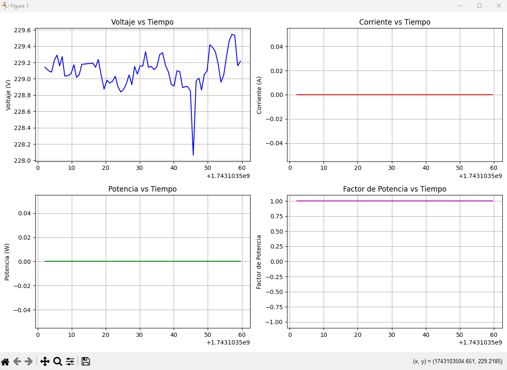

# Power Meter Data Logger
The main purpose of this project is to monitor power meter data in real-time through plots and save the data for later analysis. **Note:** The code and outputs are in Spanish.



## Project Structure
```
25-007 Trefimet/
├── src/
│   ├── config/
│   │   └── sensors/
│   │       └── sdm630_power_meter.json
│   ├── __init__.py
│   ├── sensor_reader.py
│   ├── data_logger.py
│   └── plotter.py
├── results/
│   └── {measurement_name}/
│       ├── data.xlsx
│       ├── last_real_time_plot.png
│       └── plots/
│           ├── Voltage_F1.png
│           ├── Current_F1.png
│           └── ...
├── tests/
│   ├── __init__.py
│   ├── test_sensor_reader.py
│   ├── test_data_logger.py
│   └── test_plotter.py
├── main.py
└── README.md
```

## Configuration
Before running the tests or the main program:

1. Verify the sensor connection:
   - Correct COM port
   - Baud rate
   - Parity
   - Sampling frequency

2. Configure the sensor JSON file:
   ```bash
   python create_json.py
   ```
   This script will generate a configuration file in:
   `/src/config/sensors/sdm630_power_meter.json`

## Main Usage
The `main.py` file allows:
- Real-time monitoring of sensors
- Automatic data storage in Excel format
- Visualization of measurements

### How to Run
1. Navigate to the main project directory:
   ```bash
   cd Python_25_007
   ```
2. Run the main file:
   ```bash
   python main.py
   ```

When the program starts, you will be prompted to name the measurement folder. The results will be saved in the `results/{measurement_name}/` directory.

### Example Output
If the measurement name is `test_measurement`, the results will be saved in:
```
results/
└── test_measurement/
    ├── data.xlsx
    ├── last_real_time_plot.png
    └── plots/
        ├── Voltage_F1.png
        ├── Current_F1.png
        └── ...
```

## Sensor Classes
Each sensor is implemented as a separate class in the project. For example:
- `SDM630Sensor`: Class to handle the SDM630 power meter.
- New sensors can be added by creating new classes that inherit from `BaseSensor`.

## Tests
Before running the tests:
1. Ensure the JSON configuration file is correctly set up.
2. Verify the physical connection of the sensor.
3. Confirm that the serial port is available.

To run the tests:
```bash
python -m pytest tests/ --html=results/tests/$(date +%Y%m%d_%H%M%S)/test_results.html
```

## Results Structure
- `/results/{measurement_name}/`: Contains the measurements and plots for the specific measurement.
  - `data.xlsx`: Excel file with all measurements.
  - `last_real_time_plot.png`: The last real-time plot saved when the program was stopped.
  - `plots/`: Folder containing individual plots for each parameter (e.g., `Voltage_F1.png`, `Current_F1.png`, etc.).
- `/results/tests/`: Contains the results of unit tests.