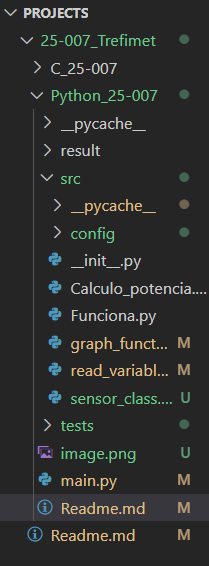

# Power Meter Data Logger
The main idea is to be able to see real time plots. And afterwards save them


## Estructura del Proyecto
```
25-007 Trefimet/
├── config/
│   └── sensors/
│       └── sdm630_power_meter.json
├── src/
│   ├── __init__.py
│   ├── sensor_reader.py
│   ├── data_logger.py
│   └── plotter.py
├── tests/
│   ├── __init__.py
│   ├── test_sensor_reader.py
│   ├── test_data_logger.py
│   └── test_plotter.py
├── results/
│   ├── measurements/
│   │   └── {timestamp}/
│   │       ├── data.xlsx
│   │       └── plots/
│   └── tests/
│       └── {timestamp}/
│           ├── test_results.html
│           └── test_data.json
├── main.py
└── README.md
```


## Configuración
Antes de ejecutar las pruebas o el programa principal:

1. Verifique la conexión del sensor:
   - Puerto COM correcto
   - Velocidad de baudios (Baud rate)
   - Paridad
   - Frecuencia de muestreo

2. Configure el archivo JSON del sensor:
   ```bash
   python create_json.py
   ```
   Este script generará un archivo de configuración en:
   `/config/sensors/sdm630_power_meter.json`

## Uso Principal
El archivo `main.py` permite:
- Monitoreo en tiempo real de los sensores
- Almacenamiento automático de datos en formato Excel
- Visualización de mediciones

Para ejecutar:
```bash
python main.py
```

## Pruebas
Antes de ejecutar las pruebas:
1. Asegúrese que el archivo JSON de configuración esté correctamente configurado
2. Verifique la conexión física del sensor
3. Confirme que el puerto serie esté disponible

Para ejecutar las pruebas:
```bash
python -m pytest tests/ --html=results/tests/$(date +%Y%m%d_%H%M%S)/test_results.html
```

## Estructura de Resultados
- `/results/measurements/`: Contiene las mediciones organizadas por timestamp
  - `data.xlsx`: Archivo Excel con todas las mediciones
  - `plots/`: Gráficos generados durante el monitoreo
- `/results/tests/`: Contiene los resultados de las pruebas unitarias